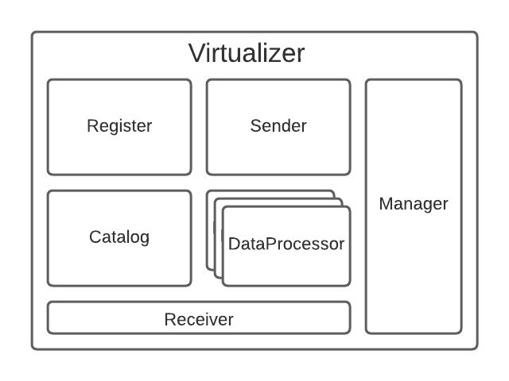
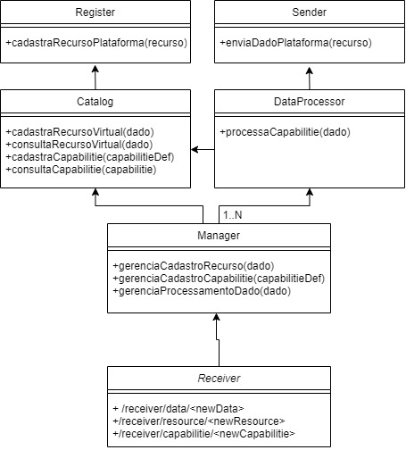

# IoTVirtualizer

<br>

<br>

<br>
• Receiver: Implementa a camada responsavel por receber os dados e traduzir as
requisicoes para os metodos internos, pode assumir uma interface REST ou Pub-
Sub;

• Manager: Orquestra as operacoes internas do Virtualizer, e responsavel pelo
fluxo de envio de mensagens e cadastro de novos recursos e operacoes/capabilities
do Virtualizer;

• Catalog: E responsavel pelos dados dos recursos virtuais e definicoes de
operacooes/capabilities que o Virtualizer realiza. Realiza o armazenamento e prove
esses dados aos outros componentes quando requisitado;

• Register: Registra o recurso virtual na plataforma e retorna o uuid de cadastro e caso necessário, (TRABALHO FUTURO) realiza o registro do virtualizer no cadastro dos sensores referenciados pelo recurso virtual em IoTGateways.

• DataProcessor: Responsavel pelo processamento dos dados do recurso virtual. A
cada novo processamento de dados uma instancia nova do componente e criada,
ou seja, cada capabilitie processada resulta na instanciacao de um DataProcessor
diferente, onde o dado e processado. (Ps.:Para esse componente, preciso realizar
um teste na InterSCity para avaliar se essa proposta de funcionamento e viavel,
visto que gerariamos uma requisicao por Capabilitie a plataforma);

• Sender: Envia os dados processados a plataforma.

## Data Template: 

### Exemplo dado p/registro de um Recurso Virtual

O registro de um Recurso Virtual possui os seguintes dados:

regInfos: Para Virtual Resources, segue os padrões de dados de registro da plataforma InterSCity, contem os dados necessários para cadastro de um recurso na platafomra.

realSensors: Parâmetros que possibilitam encontrar os sensores REAIS através do Resource Discoverer e localizar o endereço de conexão direta com o sensor para requisitar/receber os dados do sensor diretamente. Os parâmetros que podem ser utilizados são: "uuid", "lat", "lon", "radius" e "capabilities"

Exemplo:

>PUT: /resources/{data}

```json
# Registro de um novo recurso Virtual
{
"regInfos":{
	"description": "A simple virtual sensor",
	"capabilities": [
		"maxTemperature",
		"minTemperature",
		"averageTemperature"
	],
	"status": "active",
	"lat":10,
	"lon":12
},
"realSensors":{
	"0": {"uuid":"45b7d363-86fd-4f81-8681-663140b318d4","capabilities":["temperature"]}, # A unic sensor
	"1": {"lat":31.3123,"lon":35.21323,"radius":50,"capabilities":["temperature","pressure"]}, # Will use sensors in a given location with a certain capability
	"2": {"lat":31.3123,"lon":35.21323,"radius":50} # It will use sensors in a certain location, but note that it will not filter only the sensors that have the capability that will be used by the resource
}}
```
### Exemplo dado p/registro de uma Capability

Name: Nome da Capability

Description: Uma descrição da capability (Info necessária para o registro na INCT)

capability_type: default = sensor (Info padrão para registro na INCT)

association: Definição da associação entre uma capability virtual e uma capability real. Segue os [padrões internos de definição de novas capabilities (TRABALHO FUTURO)](defCapability.md).

Exemplo:

>PUT: /capabilities/{data}

```json
# Registro de uma nova Capability
{
	"name":"maxTemperature",
	"description":"Max temperature of a region",
	"capability_type":"sensor",
	"association": "$max:temperature" 
}                                           
```
```json
# Registro de uma nova Capability
{
	"name":"minTemperature",
	"description":"Min temperature of a region",
	"capability_type":"sensor",
	"association": "$min:temperature" 
}                                           
```
```json
# Objetivo de associação entre Capabilities
{
	"name":"exampleAssociation"
	....,
	"association": "$average:$maxtemperature,$mintemperature" 
}                                           
```

### Dado Recebido pelo Virtualizer
```json
{
	"temperature": 30,
	"pressure": 1,
	"light": 213
}
```
