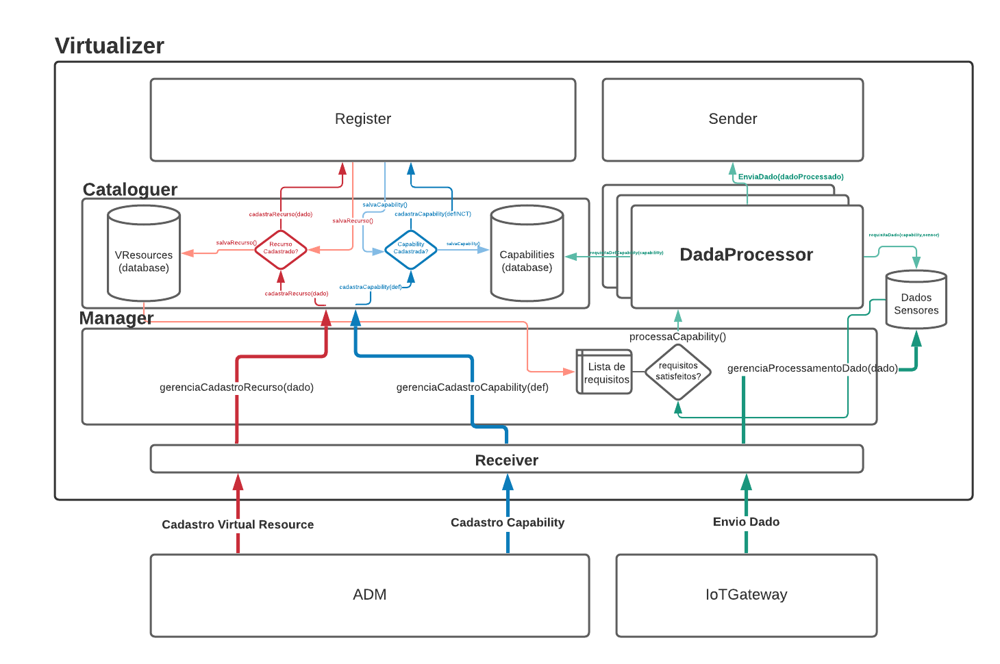
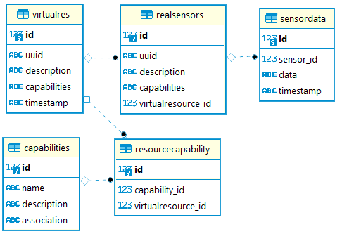

# IoTVirtualizer

O objetivo do IoTVirtualizer é realizar o processamento de capabilities complexas para a platagorma InterSCity(INCT) a partir de um conjunto de sensores reais, anteriormente cadastrados na plataforma INCT.

## Componentes IoTVirtualizer

<br>
• Receiver: Implementa a camada responsavel por receber os dados e traduzir as
requisicoes para os metodos internos, pode assumir uma interface REST ou Pub-
Sub;

• Manager: Orquestra as operacoes internas do Virtualizer, e responsavel pelo
fluxo de envio de mensagens e cadastro de novos recursos e operacoes/capabilities
do Virtualizer;

• Catalog: É responsavel pelos dados dos recursos virtuais e definicoes de
operacooes/capabilities do IoTVirtualizer. Realiza o armazenamento e provê acesso à consulta na base de dados;

• Register: Realiza o registro do o recurso virtual na plataforma INCT e retorna o uuid de cadastro,<span style="color: gray"> (TRABALHO FUTURO) realiza o registro do virtualizer no cadastro dos sensores referenciados pelo recurso virtual em IoTGateways.</span>

• DataProcessor: 

<span style="color: gray"> (TRABALHO FUTURO) (Modo Assíncrono) Responsavel pelo processamento dos dados do recurso virtual. A cada novo processamento de dados uma instancia nova do componente é criada, ou seja, cada capabilitie processada resulta em um processamento de dados diferente. </span> 

(Modo Sequencial) Um método chamado Ativador de Processos do Manager é responsável por monitorar a base de dados e realizar a iniciação do processamento. Assim que uma certa restrição para o processamento é satisfeita o processamento de dados é iniciado. (ex: número mínimo de dados dos sensores.)

• Sender: Envia os dados processados à plataforma INCT.

## Fluxo de Mensagem (Implementação Atual)


Cadastro Virtual Resource

- [RECEIVER] A mensagem é recebida pelo Receiver através de interface REST;

- [MANAGER] Manager encaminha o novo cadastro ao cataloguer;

- [Register] <span style="color: yellow"> Realiza o cadastro do Recurso Virtual na INCT, busca o endereço do Gateway dos sensores reais na INCT e realiza o cadastro nos IoT Gateways; </span>

- [Cataloguer] Guarda as informações de cadastro na base de dados local.

Cadastro Capability

- [RECEIVER] A mensagem é recebida pelo Receiver através de interface REST;

- [MANAGER] Manager encaminha o novo cadastro ao cataloguer;

-  [Register] <span style="color: yellow"> Realiza o cadastro da nova Capability na INCT; </span>

- [Cataloguer] Guarda as informações de cadastro na base de dados local.

Envio Dado
- [RECEIVER] A mensagem é recebida pelo Receiver através de interface REST ou Pub-Sub;

- [MANAGER] Guarda o dado do Sensor na base de dados, referenciando o Sensor Real que o dado pertence.

>OBS.: Os próximos passos são realizados de forma independe dos anteriores. São realizados em loop a cada período de tempo.

ProcessActivator

- [MANAGER] Realiza a consulta no banco de dados de todos os dados recebidos de um Recurso Virtual para o processamento de cada capability;

- [MANAGER] Verifica se a restrição de processamento é satisfeita (Exemplo: Minímo de 10 dados reais). Caso a restrição seja satisfeita o processamento do dado é iniciado;

- [DATA PROCESSOR] Processa o dado de acordo com a definição da capability sobre o conjunto de dados recebidos.

- [SENDER] <span style="color: yellow"> Envia o dado processado à INCT. </span>

>OBS.: Sempre que os dados dos sensores são buscados na base de dados para o processamento, o campo "timestamp" do dado é verificado. Dados "velhos" são deletados da base de dados para não puluir o resultado do processamento.

<br>

Modelo da Base de Dados


<br>
<span style="color:gray"> Imagem gerada automaticamente pelo DBeaver</span>
<br>
<br>

## Data Template: 

### Exemplo dado p/registro de um Recurso Virtual

O registro de um Recurso Virtual possui os seguintes dados:

regInfos: Para Virtual Resources, seguimos os padrões de dados de registro da INCT. Contém os dados necessários para cadastro de um recurso na platafomra.

realSensors: Parâmetros que possibilitam encontrar os sensores reais através do Resource Discoverer e localizar o endereço de conexão direta com o Gateway do sensor. <span style="color: gray"> (TRABALHO FUTURO) Os parâmetros que podem ser utilizados são: "uuid", "lat", "lon", "radius" e "capabilities" </span>

Exemplo:

>PUT: /resources

```json
# Registro de um novo recurso Virtual
{
"regInfos":{
	"description": "A simple virtual sensor",
	"capabilities": [
		"maxTemperature",
		"minTemperature",
		"averageTemperature"
	],
	"status": "active",
	"lat":10,
	"lon":12
},
"realSensors":[
	{"uuid":"45b7d363-86fd-4f81-8681-663140b318d4","capabilities":["temperature"]},
	{"lat":31.3123,"lon":35.21323,"radius":50,"capabilities":["temperature","pressure"]},
	{"lat":31.3123,"lon":35.21323,"radius":50}
	]
}
```

### Exemplo dado p/registro de uma Capability

Name: Nome da Capability

Description: Uma descrição da capability <span style="color: gray"> (Info necessária para o registro na INCT) </span>

association: Definição da associação entre uma capability virtual e uma capability real. Segue os [padrões internos de definição de novas capabilities (TRABALHO FUTURO)](defCapability.md).

Exemplo:

>PUT: /capabilities

```json
# Registro de uma nova Capability
{
	"name":"maxTemperature",
	"description":"Max temperature of a region",
	"association": "$max:temperature" 
}                                           
```
```json
# Registro de uma nova Capability
{
	"name":"minTemperature",
	"description":"Min temperature of a region",
	"capability_type":"sensor",
	"association": "$min:temperature" 
}                                           
```
```json
# (TRABALHO FUTURO)
{
	"name":"exampleAssociation"
	....,
	"association": "$average:$maxtemperature,$mintemperature" 
}                                           
```
### Dado Recebido pelo Virtualizer

>PUT: /data <span style="color: gray">

><span style="color: gray">(TRABALHO FUTURO) PUT: /resources/{virtualResource}/data</span>
```json
{
	"uuid":"45b7d363-86fd-4f81-8681-663140b318d4",
	"data":{
		"temperature": 30,
		"pressure": 1,
		"light": 213
	}
}
```
